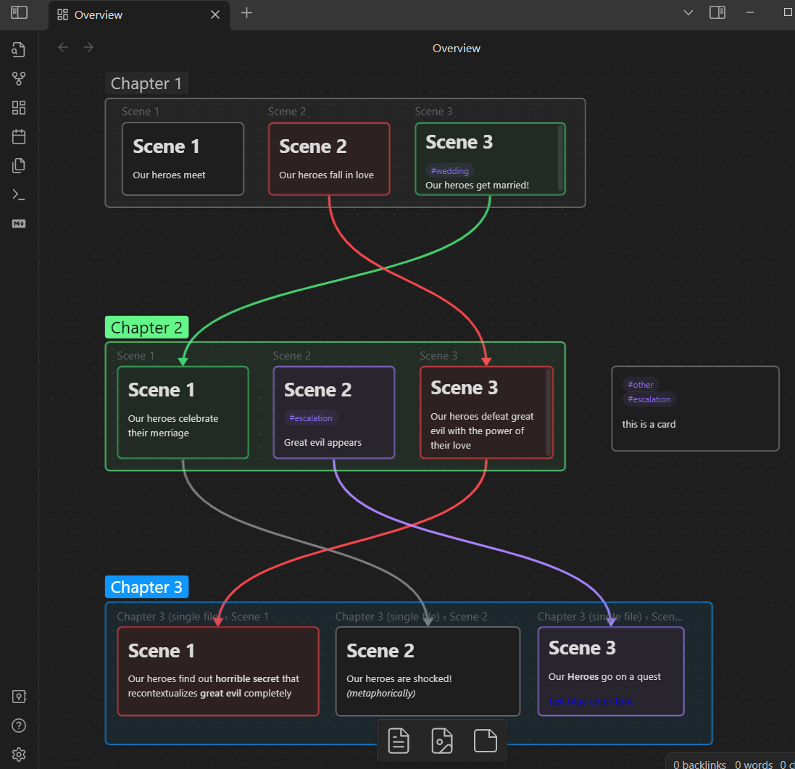
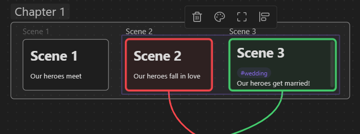
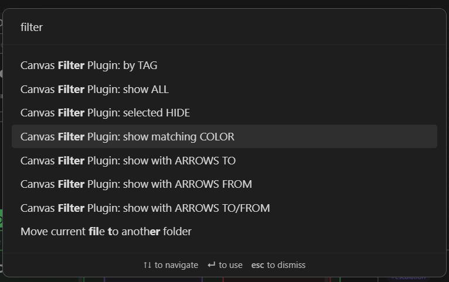
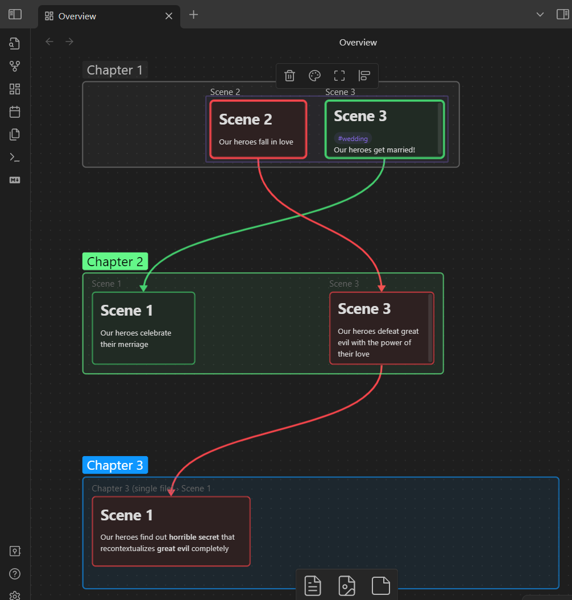
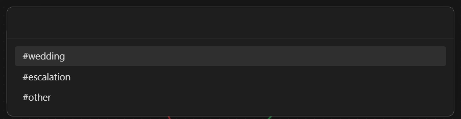
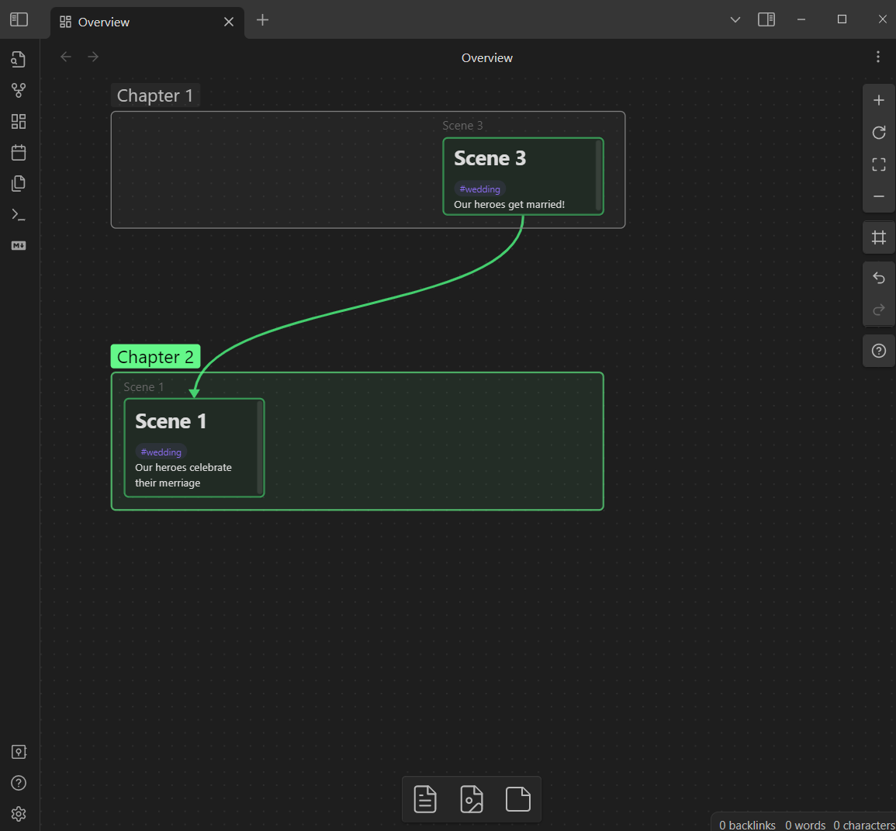

# Obsidian Canvas Filter Plugin

This is a plugin for Obsidian Canvas (https://obsidian.md), 
it allows to select nodes by color / connections / tags and show 
only those nodes (hide all unrelated)

## Usage

When you have a canvas like this: 

Select one or more nodes, whose color you are interested in:

Open console and select filter command:

Your nodes will be filtered: 

You can also filter by arrow connections to and from selected nodes.

Additionally, you can filter by Tags:

You can also just hide selected nodes. 

Please note, that nodes are still part of the canvas in the same positions they were, they are just not visible for the moment. Opening and closing canvas will restore visibility.